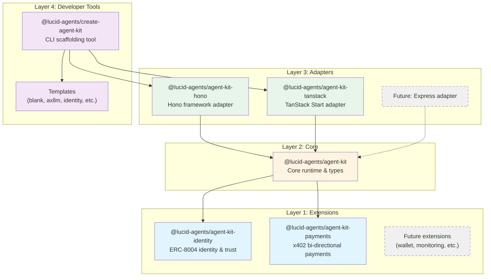
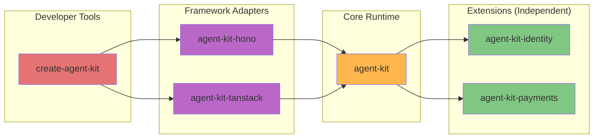
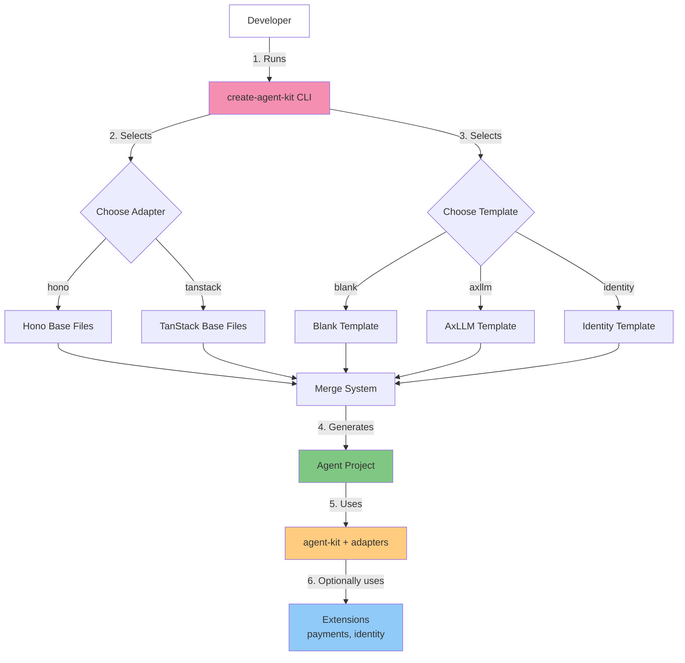
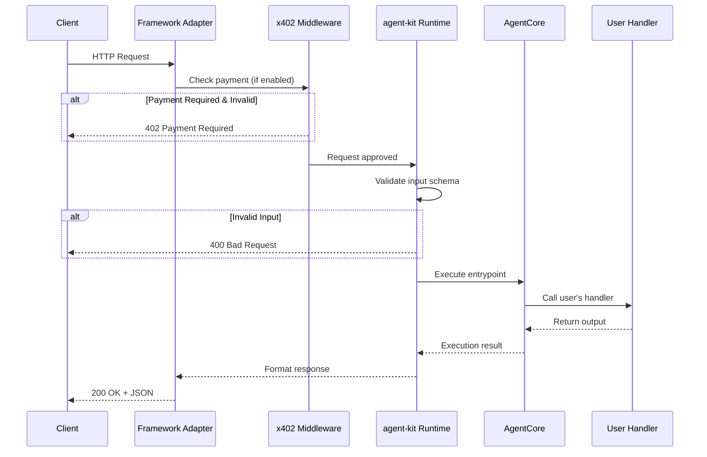
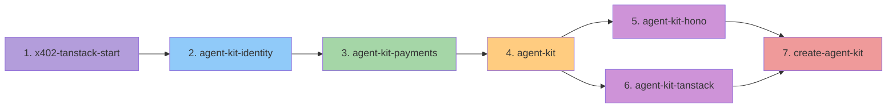
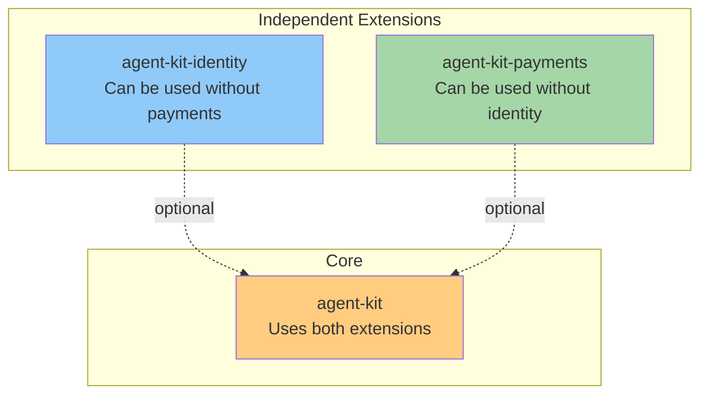
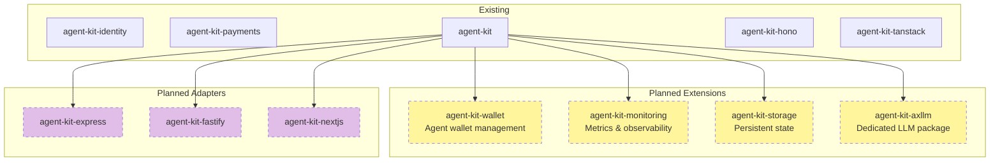

# Lucid Agents - SDK Architecture

High-level architecture overview of the Lucid Agents SDK.

## Package Structure

The SDK is organized into four architectural layers:

## Dependency Graph

## Layer 1: Extensions

Extensions add optional capabilities. They are independent and don't depend on each other.

### @lucid-agents/agent-kit-identity

**Purpose:** ERC-8004 on-chain identity and trust layer

**Provides:**

- Registry clients (Identity, Reputation, Validation)
- Trust configuration
- Domain proof signing
- `createAgentIdentity()` bootstrap function

**Dependencies:** `viem` (Ethereum interactions)

---

### @lucid-agents/agent-kit-payments

**Purpose:** x402 payment protocol (bi-directional)

**Provides:**

- Entrypoint definitions (priced capabilities)
- Payment requirement resolution (server-side)
- x402 client utilities (client-side)
- AxLLM integration with payments
- Payment configuration and validation

**Dependencies:** `x402`, `x402-fetch`, `@ax-llm/ax`, `@lucid-dreams/agent-auth`, `zod`

## Layer 2: Core

### @lucid-agents/agent-kit

**Purpose:** Framework-agnostic agent runtime

**Provides:**

- Agent execution (`AgentCore`)
- HTTP request handlers
- Server-Sent Events (SSE) streaming
- Manifest generation (AgentCard, A2A)
- Configuration management
- Landing page UI
- AxLLM client wrapper

**Dependencies:** `agent-kit-payments`, `agent-kit-identity`

## Layer 3: Adapters

Adapters integrate the core runtime with specific web frameworks.

### @lucid-agents/agent-kit-hono

**Purpose:** Hono framework integration

**Provides:**

- `createAgentApp()` - Returns Hono app instance
- `withPayments()` - x402-hono middleware wrapper

**Dependencies:** `agent-kit`, `hono`, `x402-hono`

---

### @lucid-agents/agent-kit-tanstack

**Purpose:** TanStack Start framework integration

**Provides:**

- `createTanStackRuntime()` - Returns runtime & handlers
- `withPayments()` - x402-tanstack middleware wrapper

**Dependencies:** `agent-kit`, `@tanstack/start`, `x402-tanstack`

## Layer 4: Developer Tools

### @lucid-agents/create-agent-kit

**Purpose:** CLI for scaffolding new agent projects

**Provides:**

- Interactive project wizard
- Template system (blank, axllm, identity, axllm-flow)
- Adapter selection (hono, tanstack-ui, tanstack-headless)
- Merge system (combines adapter + template)

**Dependencies:** All agent-kit packages

## Developer Flow

## Request Flow

How an HTTP request flows through the system:

## Build Order

Packages must build in dependency order:

## Package Responsibilities

| Package              | Responsibility                                               |
| -------------------- | ------------------------------------------------------------ |
| `agent-kit-identity` | ERC-8004 on-chain identity, registries, trust models         |
| `agent-kit-payments` | x402 protocol, EntrypointDef, pricing, payment client/server |
| `agent-kit`          | Core runtime, HTTP handlers, SSE, manifest, config, UI       |
| `agent-kit-hono`     | Hono framework integration, middleware wiring                |
| `agent-kit-tanstack` | TanStack framework integration, middleware wiring            |
| `create-agent-kit`   | CLI tool, templates, project scaffolding                     |

## Extension Independence

Extensions are independent modules that core can optionally use. Neither depends on the other.

## Future Roadmap

Planned extensions and adapters:

## Summary

The Lucid Agents SDK follows a **layered, modular architecture**:

1. **Extensions** - Independent capabilities (identity, payments)
2. **Core** - Framework-agnostic runtime
3. **Adapters** - Framework-specific integrations
4. **Tools** - Developer experience (CLI, templates)

This enables:

- **Modularity** - Use only what you need
- **Extensibility** - Easy to add new extensions and adapters
- **Clarity** - Clear package boundaries
- **Scalability** - Foundation for future growth
